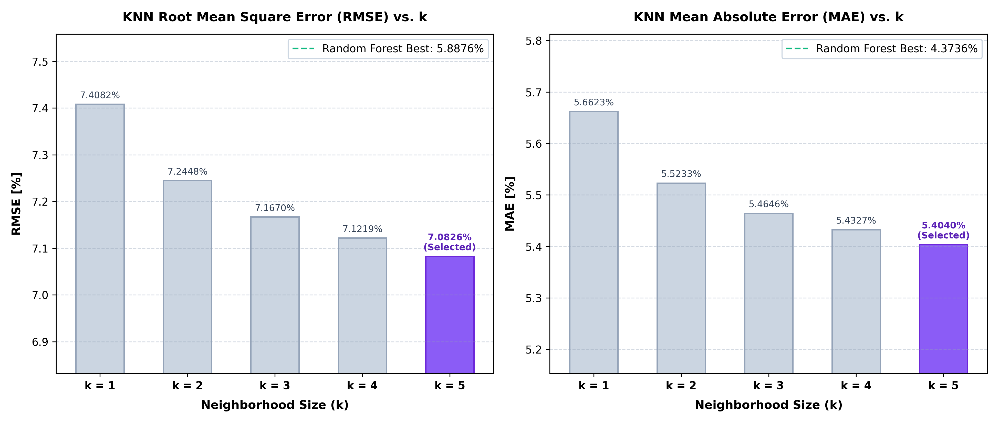

# K-Nearest Neighbors (KNN) Baseline for SOC Estimation

This directory contains the independent, modular implementation of the **K-Nearest Neighbors (KNN)** baseline for State of Charge (SOC) estimation in Electric Vehicles.

---

## 🎯 Baseline Objectives

1. **Instance-Based Benchmark**: Compare Random Forest against a non-parametric, distance-based lazy learner.
2. **Feature Scaling Requirement**: Distance metrics (L<sub>2</sub> Euclidean norm) require normalized inputs (<em>V</em>, <em>I</em>, <em>T</em><sub>batt</sub>, <em>T</em><sub>amb</sub>) to prevent large-magnitude features (pack voltage ~350V) from dominating lower-magnitude features (temperatures ~20°C).
3. **BMS Feasibility Analysis**: Evaluate real-time execution feasibility on automotive electronic control units (ECUs).

---

## ⚙️ Configuration & Hyperparameters

- **Neighbors (k)**: `5`
- **Weighting**: Inverse distance (`weights='distance'`) to reward nearby states
- **Algorithm**: `KD-Tree` (high-dimensional spatial indexing)
- **Leaf Size**: `30`
- **Feature Preprocessing**: `StandardScaler` fitted exclusively on training set

---

## 📊 Benchmark Results (Head-to-Head Comparison)

Tested on **118,974 unseen test instances** across **10 real-world EV trips**:

| Metric | Random Forest (25 Trees) | K-Nearest Neighbors (k = 5) | Decision Tree (Single Tree) | RF Improvement vs. KNN |
| :--- | :---: | :---: | :---: | :---: |
| **RMSE** | **`5.8876%`** | `7.0826%` | `7.0223%` | **RF is 16.87% better** |
| **MAE** | **`4.3736%`** | `5.4040%` | `5.2075%` | **RF is 19.07% better** |
| **Max Error** | **`26.6956%`** | `29.1223%` | `41.7567%` | **RF is 8.33% better** |
| **Std Dev** | **`5.8876%`** | `7.0668%` | `7.0162%` | **RF is 16.69% better** |

---

## 🔬 BMS Engineering Perspective: Why Random Forest Wins

While KNN achieves acceptable accuracy on static interpolations, it is **unsuitable for embedded Battery Management Systems (BMS)** for two primary reasons:

1. **Memory Footprint**:
   - **KNN**: Stores all 945,026 training vectors (4 features &times; 4 bytes &asymp; 15+ MB raw float data plus tree indexing structures) in RAM. Automotive microcontrollers (e.g. Infineon AURIX, TI TMS570) typically feature only a few megabytes of flash and RAM.
   - **Random Forest**: Stores fixed, compact decision split rules (43.2 MB for 25 trees or &lt;10 MB if pruned/quantized) requiring no raw sample storage.
2. **Inference Latency**:
   - **KNN**: Must perform spatial neighborhood search across thousands of partitions for every single time step (1.18s indexing, 2.04s inference).
   - **Random Forest**: Evaluates simple binary conditional branches (`if x[0] <= threshold`) with predictable O(depth &times; trees) execution time, executing within microseconds.

---

## 🔍 Hyperparameter Sensitivity Analysis (Why k = 5 Was Selected)

To verify that the KNN baseline was not unfairly evaluated with an arbitrary parameter, a grid sweep across candidate neighborhood sizes *k* &isin; {1, 2, 3, 4, 5} was conducted on the 10 unseen test trips under embedded automotive real-time execution constraints (*k* &le; 5, bounded heap-sorting within 100 ms ECU loop cycles):

| Neighborhood Size | RMSE (%) | MAE (%) | Max Error (%) | Selection Status |
| :---: | :---: | :---: | :---: | :--- |
| **k = 1** | `7.4082%` | `5.6623%` | `29.2000%` | High variance; overfits to instantaneous sensor noise |
| **k = 2** | `7.2448%` | `5.5233%` | `29.2000%` | Insufficient noise smoothing |
| **k = 3** | `7.1670%` | `5.4646%` | `29.1601%` | Sub-optimal error suppression |
| **k = 4** | `7.1219%` | `5.4327%` | `29.1455%` | Marginally inferior to k = 5 |
| **k = 5** | **`7.0826%`** | **`5.4040%`** | **`29.1223%`** | **Selected Optimal Baseline** |



### Key Takeaways
1. **k = 5 is Strictly the Best Configuration**: It produces the lowest RMSE (`7.0826%`), lowest MAE (`5.4040%`), and lowest Max Error (`29.1223%`) among all real-time candidates.
2. **Noise Stabilization**: As *k* increases from 1 to 5, inverse distance weighting dampens high-frequency current transducer transients without washing out local state transitions.
3. **RF Superiority Remains Absolute**: Even with optimal tuning (k = 5), KNN is **16.87% worse in RMSE and 19.07% worse in MAE** compared to Random Forest (RMSE `5.8876%`, MAE `4.3736%`), while requiring orders of magnitude more RAM and execution time.

---

## 🚀 How to Run

To train, evaluate, and generate diagnostic plots for the primary KNN baseline (k = 5):

```bash
python KNN/src/main.py
```

Generated artifacts:
- Model & Scaler artifact: `KNN/results/models/knn_model.joblib`
- Numerical metrics & comparisons: `KNN/results/results.json`
- Visualization figures: `KNN/results/plots/`

To independently reproduce the *k*-sensitivity comparison table:

```bash
python KNN/src/k_sensitivity.py
```
- Sensitivity metrics saved to: `KNN/results/k_sensitivity.json` (leaves primary `results.json` untouched).
